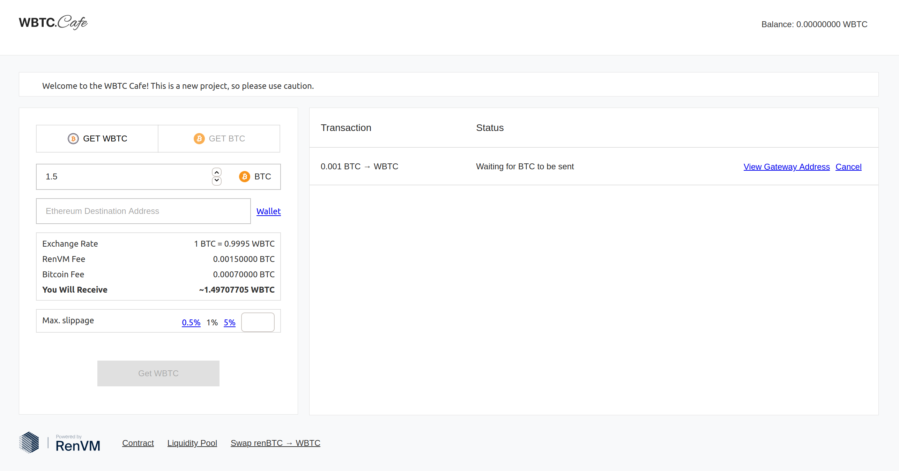

`☕ WBTC.Cafe`

Acquire WBTC with real BTC.



## Local Development

`☕ WBTC.Cafe` uses Firebase to store deposit details. You need a firebase key:

```sh
export REACT_APP_FB_KEY="YOUR_KEY_HERE"
```

Install dependencies:

```
yarn install
```

Serve the front-end:

```sh
yarn start
```

The front-end should now be live at [localhost:3000](http://localhost:3000).
